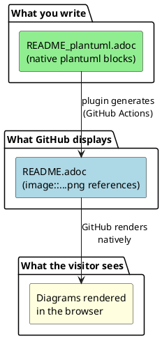
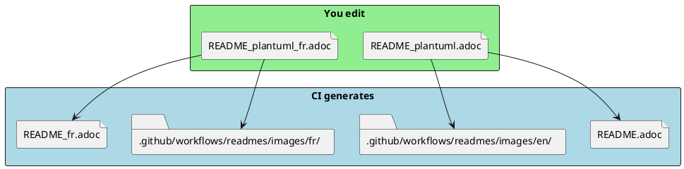
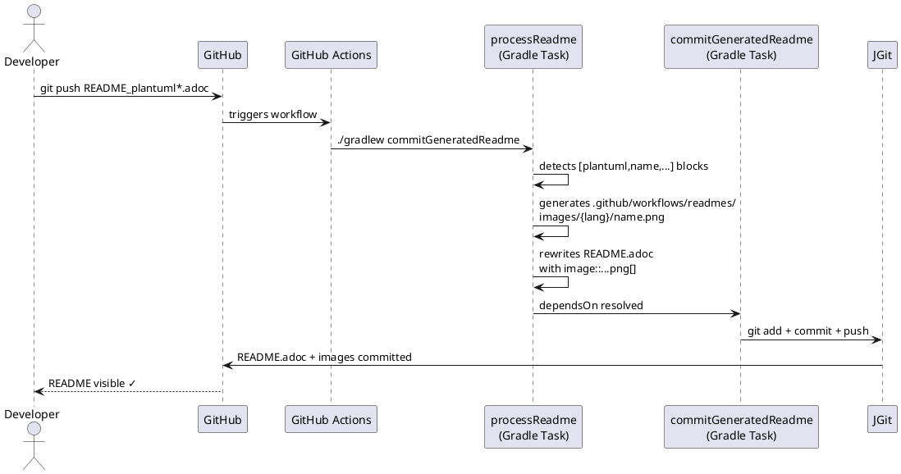
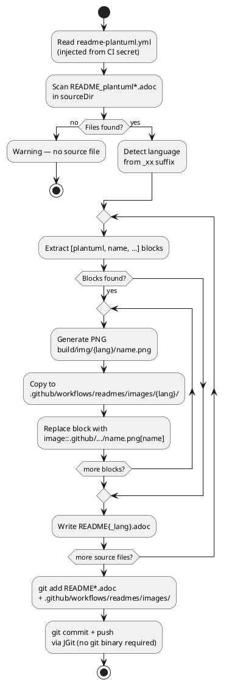
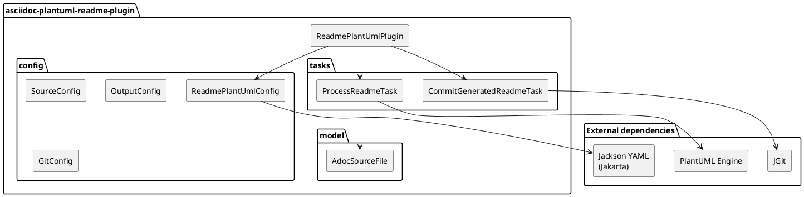
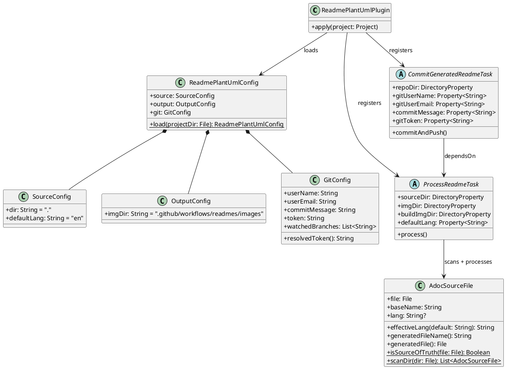
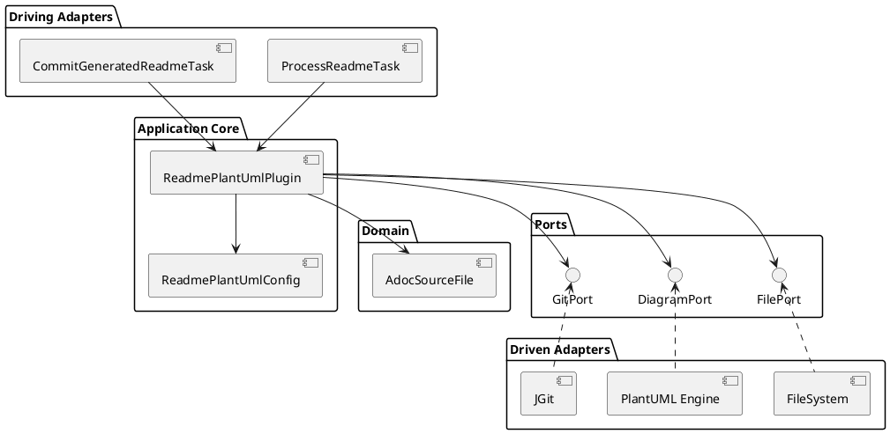

= asciidoc-plantuml-readme-plugin
:toc:
:toclevels: 3
:icons: font
:source-highlighter: highlight.js

Gradle plugin published under the Apache 2.0 license on the link:https://plugins.gradle.org[Gradle Plugin Portal].

It automatically generates GitHub-compatible `README.adoc` files from `README_plantuml.adoc` source files containing native PlantUML blocks.

== 1. Problem solved

GitHub does not natively render PlantUML syntax in AsciiDoc files.
A `[plantuml]` block displayed as-is on github.com is not rendered as an image.

This plugin automates the transformation via GitHub Actions:

== 2. Philosophy: single source of truth

`README_plantuml.adoc` is the **only file you edit**.
`README.adoc` is a generated artifact — never edited by hand.

=== Multilingual naming convention

[cols="1,1,1", options="header"]
|===
| Source file (you edit)
| Detected language
| Generated file (CI)

| `README_plantuml.adoc`
| `en` (configurable default)
| `README.adoc`

| `README_plantuml_fr.adoc`
| `fr`
| `README_fr.adoc`

| `README_plantuml_de.adoc`
| `de`
| `README_de.adoc`
|===

== 3. How it works

=== Overview

=== Activity diagram

== 4. Internal architecture

=== Components

=== Class diagram

=== Hexagonal architecture

== 5. Installation

=== Project structure

[source,text]
----
my-project/                               <1>
├── settings.gradle.kts
├── build.gradle.kts
├── readme-plantuml.yml                   <2>
├── README_plantuml.adoc                  <3>
├── README_plantuml_fr.adoc               <3>
│
└── plugin/                               <4>
    ├── settings.gradle.kts
    ├── build.gradle.kts
    └── src/main/kotlin/...
----
<1> Consumer project — root
<2> Plugin configuration (injected from CI secret)
<3> Sources of truth — the only files you edit
<4> Plugin as local composite build

=== `settings.gradle.kts` (consumer)

[source,kotlin]
----
rootProject.name = "my-project"

pluginManagement {
    includeBuild("plugin")    // <1>
}
----
<1> Local resolution — no publication required during development

=== `build.gradle.kts` (consumer)

[source,kotlin]
----
plugins {
    id("io.github.ton-org.asciidoc-plantuml-readme")  // <1>
}
----
<1> No version required in local composite build

=== Generated file structure

[source,text]
----
my-project/
├── README.adoc                                        <1>
├── README_fr.adoc                                     <1>
└── .github/
    └── workflows/
        ├── readme_plantuml.yml                        <2>
        └── readmes/
            └── images/
                ├── en/
                │   ├── architecture.png               <1>
                │   └── sequence.png                   <1>
                └── fr/
                    ├── architecture.png               <1>
                    └── sequence.png                   <1>
----
<1> Artifacts generated by CI — never edit these
<2> GitHub Actions workflow

== 6. Configuration

Configuration is externalized in `readme-plantuml.yml`.
This file **never** contains the token in plain text in the repository.
Its full content (token included) is stored in the GitHub secret `README_GRADLE_PLUGIN`.

=== `readme-plantuml.yml` template

[source,yaml]
----
source:
  dir: "."                    # <1>
  defaultLang: "en"           # <2>

output:
  imgDir: ".github/workflows/readmes/images"  # <3>

git:
  userName: "github-actions[bot]"
  userEmail: "github-actions[bot]@users.noreply.github.com"
  commitMessage: "chore: generate readme [skip ci]"
  token: "<YOUR_GITHUB_PAT>"  # <4>
  watchedBranches:
    - "main"
    - "master"
----
<1> Directory containing the `README_plantuml*.adoc` files
<2> Default language when no `_xx` suffix is present in the filename
<3> Generated images folder — versioned in git
<4> Replaced by the real PAT only inside the GitHub secret

=== Secret injection in CI

[source,yaml]
----
- name: Inject plugin config
  run: echo "${{ secrets.README_GRADLE_PLUGIN }}" > readme-plantuml.yml

- name: Generate README and commit via JGit
  run: ./gradlew -q -s commitGeneratedReadme --no-daemon
----

== 7. Available Gradle tasks

[cols="1,2,1", options="header"]
|===
| Task
| Description
| Usage

| `processReadme`
| Generates PNG files and rewrites `README*.adoc`
| Local or CI

| `commitGeneratedReadme`
| Chains `processReadme` then commits + pushes via JGit
| CI only
|===

== 8. Full GitHub Actions workflow

[source,yaml]
----
name: Generate README from PlantUML sources

on:
  push:
    branches:
      - main
      - master
    paths:
      - "README_plantuml*.adoc"

  workflow_dispatch:

jobs:
  generate-readme:
    runs-on: ubuntu-latest
    permissions:
      contents: write

    steps:
      - uses: actions/checkout@v4
        with:
          fetch-depth: 0

      - uses: actions/setup-java@v4
        with:
          java-version: '17'
          distribution: 'temurin'
          cache: gradle

      - name: Grant execute permission for gradlew
        run: chmod +x gradlew

      - name: Inject plugin config
        run: echo "${{ secrets.README_GRADLE_PLUGIN }}" > readme-plantuml.yml

      - name: Generate README and commit via JGit
        run: ./gradlew -q -s commitGeneratedReadme --no-daemon
----

== 9. Dependencies

[cols="2,1,2", options="header"]
|===
| Dependency
| Version
| Role

| `net.sourceforge.plantuml:plantuml`
| `1.2024.3`
| PNG generation from PlantUML blocks

| `org.eclipse.jgit:org.eclipse.jgit`
| `6.9.0`
| Git operations without a system git binary

| `tools.jackson.dataformat:jackson-dataformat-yaml`
| `3.0.4`
| Parsing of `readme-plantuml.yml`

| `tools.jackson.module:jackson-module-kotlin`
| `3.0.4`
| YAML → Kotlin data class mapping (Jakarta)
|===

== 10. License

Distributed under the link:https://www.apache.org/licenses/LICENSE-2.0[Apache 2.0] license.